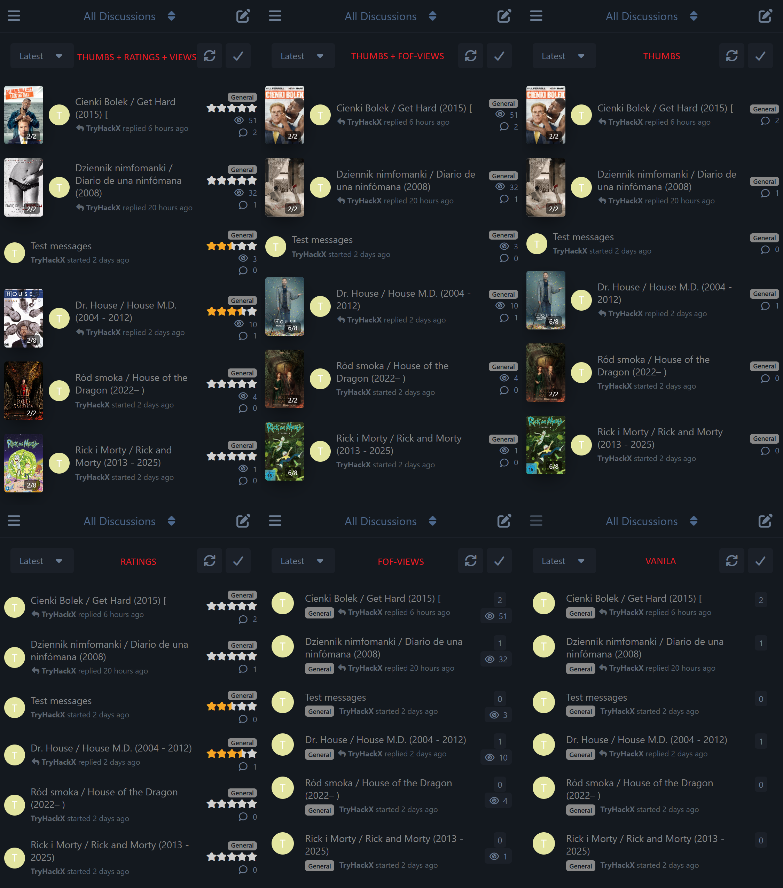
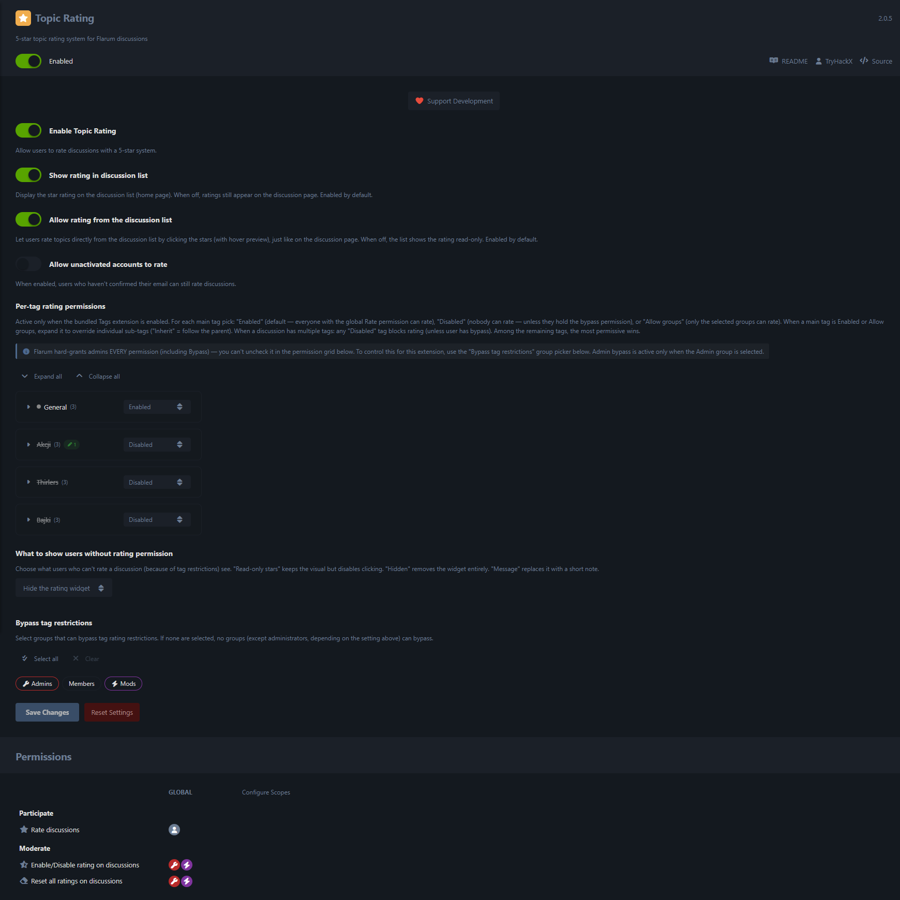

# Topic Rating for Flarum

A [Flarum](https://flarum.org/) extension that adds a 5-star rating system to
discussions with half-star precision — usable from **the discussion page
*and* the discussion list**, with a live hover preview, polling refresh, and
fine-grained admin / permission controls.

> **Latest (2.4.3):** Accuracy & robustness pass — the per-tag permissions help
> now correctly describes **most-permissive-wins** (a single *Disabled* tag does
> *not* block rating if another of the discussion's tags allows it; a topic is
> non-rateable only when **all** its tags are disabled), the Polish *"last rated"*
> label is translated, and concurrent first-time rating writes no longer risk a
> duplicate-key error. See the [changelog](CHANGELOG.md).
>
> **2.4.x:** Finer **per-tag control** — a dedicated list for
> **standalone secondary tags** (topics with no primary tag; opt-in, default
> off), a switch for **tagless** discussions, an option to **hide empty stars**
> from non-voters, and one to **hide "frozen" ratings** on topics that became
> non-rateable (anti-abuse). The rating moderation items (*Disable Rating* /
> *Reset All Ratings*) now follow the widget's visibility in the ⋮ menu, with an
> *always-show* override.
>
> **2.2.0:** Per-device discussion-list **display styles** (full stars / single
> star + score / graded star, *in place* or *after the title*), a **clickable
> single star** with optional **rate-from-the-modal**, and a **shared** avatar
> section synced with `flarum-thumb-sliders`. See the
> [changelog](CHANGELOG.md) for the full list.

> **Note:** Recent updates target the **2.x** line only. The **1.x** branch
> (Flarum 1.8+) is **no longer actively developed** — it stays available
> for legacy installs but won't receive new features.

## Features

- **Half-star precision** — rate from 0.5 to 5.0 (stored as 1–10).
- **Interactive on both the page and the list** — same component, same
  hover preview, same click-to-rate semantics. Clicking on the list does
  *not* open the topic, because the stars sit in a sibling node of the
  discussion link.
- **Live hover preview that works under `SubtreeRetainer`** — the rating
  component paints star classes directly on the DOM in its
  `onmouseenter` / `onmouseleave` handlers, so the preview shows even
  where Flarum blocks Mithril redraws.
- **Real-time updates** — short-poll on the discussion page keeps the
  average and "your rating" tooltip current without reloading.
- **Per-device list display styles** — choose, separately for desktop and
  mobile, how the rating renders on the list: the full 5-star range, a single
  star + numeric score (e.g. `★4.6`), or a single *graded* star
  (empty/half/full by score) — each either *in place* (the meta column above
  views/replies) or *appended to the discussion title*.
- **Clickable single star + in-modal rating** — make the compact single star
  open the ratings modal, and optionally add an interactive rating control at
  the top of that modal so people can rate without leaving the list.
- **Ratings modal** — click the count (or the single star) to see who rated,
  what they gave, and when they last changed it.
- **Shared avatar control** *(synced with `flarum-thumb-sliders`)* — a
  Desktop/Mobile section to *Show* the author avatar, *Replace* it with the
  topic thumbnail, or **Hide** it entirely for a lighter list. The same setting
  appears in both extensions and changing it in one updates the other.
- **Moderator controls** — toggle rating on/off per topic, reset all
  ratings on a topic.
- **Per-tag rating permissions** *(requires `flarum/tags`)* — card-grid
  admin tree controls who can rate where. Three states per primary tag
  (*Enabled / Disabled / Allow groups*) with per-(primary × secondary)
  overrides. **Most-permissive wins** across a discussion's tags. Plus a
  dedicated list for **standalone secondary tags** (topics with no primary —
  opt-in, default off) and a switch for **tagless** discussions.
- **Bypass-group picker** — pick which groups can rate even on
  restricted tags (Admin by default; deselect Admin to subject admins
  to the same rules for testing).
- **Display mode for restricted users** — choose what users without
  rating permission see on otherwise-open topics: *Read-only stars*,
  *Hidden widget*, or *Short message* — plus an anti-abuse option to hide
  ratings entirely on topics that became non-rateable.
- **Permission-based** — global *Rate discussions* permission (Reply
  section), plus moderator-only *Enable/Disable* and *Reset all*.
- **Unactivated accounts** — optional admin toggle that lets users without
  email confirmation rate.
- **Localised** — English (`en.yml`) and Polish (`pl.yml`).

## Screenshots



*Mobile view — discussion list rendered with different combinations of TryHackX extensions (thumbnails + ratings + views, thumbnails + views, thumbnails only, ratings only, views only, vanilla Flarum).*



*Topic Rating admin panel (2.1) — base toggles at the top (*Enable*, *Show on list*, *Allow rating from list*, *Allow unactivated*), then the per-tag permission tree (card-grid of primary tags with their secondary-tag override sections), the *What to show users without rating permission* picker, the bypass-group picker, and the *Rate / Enable-Disable / Reset* permission rows at the bottom.*


*Desktop discussion list with the full TryHackX stack — star ratings sit in the right-hand meta column next to thumbnail sliders and the magnet button, click-to-rate and hover preview both active.*


*Desktop discussion list — hover state showing the magnet tooltip loading inline alongside the interactive star ratings.*

## Support Development

If you find this extension useful, consider supporting its development:

- **Monero (XMR):** `45hvee4Jv7qeAm6SrBzXb9YVjb8DkHtFtFh7qkDMxS9zYX3NRi1dV27MtSdVC5X8T1YVoiG8XFiJkh4p9UncqWGxHi4tiwk`
- **Bitcoin (BTC):** `bc1qncavcek4kknpvykedxas8kxash9kdng990qed2`
- **Ethereum (ETH):** `0xa3d38d5Cf202598dd782C611e9F43f342C967cF5`

You can also find the donation option in the extension's admin settings panel.

## Installation

```bash
composer require tryhackx/flarum-topic-rating
php flarum migrate
php flarum cache:clear
```

## Updating

```bash
composer update tryhackx/flarum-topic-rating
php flarum migrate
php flarum cache:clear
```

## Configuration

Enable the extension in **Admin Panel → Extensions → Topic Rating**.

### Settings

| Setting | Default | What it does |
| --- | --- | --- |
| **Enable Topic Rating** | On | Master switch for the extension. |
| **Allow unactivated accounts to rate** | Off | Users without email confirmation can submit ratings. |
| **Show rating in discussion list** | On | Visibility toggle for the stars on the homepage list. When off, ratings stay on the discussion page. |
| **Allow rating from the discussion list** | On | Make the *full-stars-in-place* list stars interactive (click + hover preview). When off, the list shows the rating read-only. |
| **Hide empty stars from users who can't rate** | Off | On the list, topics with **no ratings yet** don't render the widget for viewers who can't rate (guests, restricted groups). Already-rated topics still show. |
| **Display style — desktop** / **— mobile** | Full stars — in place | How the rating renders on the list, **per device**: *full stars* / *one star + score* / *one graded star (empty-half-full) + score*, each either *in place* (meta column) or *after the title*. Compact & after-title styles are display-only. |
| **Make the single star clickable** ² | On | Clicking the single star + number opens the ratings modal (even after the title). Off = display-only, and topics with **no** rating show no star at all. |
| **Allow rating inside the modal** ² | Off | Adds an interactive rating control at the top of the ratings modal, so users can rate without leaving the list. |
| **Avatars — Desktop** / **Mobile** ³ | Show avatar | Per device: *Show* / *Replace with thumbnail when the topic has an image* / *Always replace* / *Hide avatar*. |
| **Always show rating controls in the discussion menu** | Off | By default, *Disable Rating* / *Reset All Ratings* appear in the ⋮ dropdown only when the rating is shown on that topic (hidden when its tags disable rating). Turn on to always show them (still gated by the moderation permissions) — useful for managing ratings where the widget is hidden. |
| **Per-tag rating permissions** ¹ | empty / all enabled | Card-grid tree. Per-primary-tag state (*Enabled / Disabled / Allow groups*), per-(primary × secondary) override (*Inherit* by default). |
| **Secondary tags used on their own** ¹ | Disabled | Standalone list controlling discussions tagged with **only a secondary tag, no primary** (e.g. announcements posted bypassing tag-count limits). Per tag *Enabled / Disabled*; opt-in. A secondary-only topic is rateable if **any** of its secondary tags is enabled here. |
| **Allow rating on discussions with no tags** ¹ | On | When off, tagless discussions show no rating widget and can't be rated. |
| **Bypass tag restrictions** ¹ | Admin group | Groups whose members can rate even where a tag is *Disabled* or *Allow groups*. Empty = nobody bypasses. |
| **What to show users without rating permission** ¹ | Read-only stars | What viewers who can't rate an **otherwise-open** topic see: *Read-only stars* (default), *Hidden*, *Message*. |
| **Hide ratings on rating-disabled topics** ¹ | On | When a topic's rating is **fully disabled** (all its tags disabled — e.g. its tag was switched to a disabled one after it was rated), hide the widget and any existing ratings from viewers who can't rate, rather than showing them read-only. Prevents "rate then lock the score" abuse. Viewers who *can* rate still see it. |

¹ Visible only when `flarum/tags` is enabled.
² Visible only when a single-star *Display style* is selected (the modal-rate toggle appears only when "Make the single star clickable" is on).
³ **Shared** setting — the same Desktop/Mobile avatar section appears in the `flarum-thumb-sliders` admin, and changing it in either extension updates the other. The *Replace* modes only take effect when Thumb Sliders is installed and showing a thumbnail; *Hide* works regardless.

### Per-tag permissions — how the policy decides

When `flarum/tags` is enabled and at least one tag is configured, every
rating attempt walks the discussion's tags this way:

1. **Bypass short-circuits everything.** If the actor's group is in the
   bypass-group list, allow.
2. **No tags at all?** Governed by *Allow rating on discussions with no tags*
   (on → legacy global-permission decision; off → denied + hidden).
3. **Only secondary tags (no primary)?** Each secondary's standalone state
   comes from the *Secondary tags used on their own* list (**default
   Disabled**). Most-permissive wins — rateable if any one is enabled.
4. **Has a primary tag?** For every (primary, secondary) combination:
   - The compound key `primaryId_secondaryId` overrides if set;
   - Otherwise the secondary's default (`inherit`) follows the primary;
   - The primary's own state (or `enabled` if unset) applies.
5. **Most-permissive wins**: if any combination grants the actor access
   (*enabled* + has the global Rate permission, or *groups* + actor's
   group is allowed, or bypass on that tag), the rating is allowed.
6. Otherwise the rating is denied.

**Display when a topic can't be rated.** A viewer who can't rate an
*otherwise-open* topic gets the *What to show users without rating permission*
mode (read-only / hidden / message). But a topic whose rating is **fully
disabled** (every tag disabled, e.g. its tag was switched to a disabled one
after it had been rated) is hidden entirely — widget *and* existing ratings —
when *Hide ratings on rating-disabled topics* is on (the default). That
prevents "rate it, then lock in the score" abuse; viewers who *can* rate still
see it. Tagless discussions with *Allow rating on discussions with no tags*
off are likewise hidden for everyone.

### Permissions

Set in **Admin Panel → Permissions**:

| Permission | Section | Default |
| --- | --- | --- |
| Rate discussions | Reply | Members |
| Enable/Disable rating | Moderate | Mods |
| Reset all ratings | Moderate | Mods |

> Bypass for tag restrictions is **not** in the permission grid — it
> lives in the extension settings as a group-picker (see *Bypass tag
> restrictions* above). This avoids the Flarum-core admin-always-has-it
> behaviour and lets you remove Admin from the bypass list for testing.

## API surface

The extension exposes the following on the Discussion API resource:

`ratingAverage`, `ratingCount`, `lastRatedAt`, `userRating`,
`ratingDisabled`, `canRate`, `canRateRequiresActivation`,
`canToggleRating`, `canResetRatings`, `ratingDisplayMode`.

`ratingDisplayMode` is one of `rate | readonly | hidden | message` and
tells the frontend how to render the widget for the current user.

It registers these endpoints:

| Method | Path | Purpose |
| --- | --- | --- |
| `POST` | `/discussion-ratings` | Submit / update a rating. |
| `DELETE` | `/discussion-ratings` | Remove your rating. |
| `POST` | `/discussions/{id}/toggle-rating` | Toggle rating on a discussion. |
| `POST` | `/discussions/{id}/reset-ratings` | Reset all ratings on a discussion. |
| `GET` | `/discussion-ratings?discussion_id={id}` | List one discussion's ratings (the ratings modal). Requires a discussion id and is scoped to discussions the actor can view. |
| `GET` | `/discussion-ratings/poll` | Poll for fresh average / count / your-rating. |

## Compatibility

- This (`2.x`) release line requires **Flarum 2.0+** and **PHP 8.3+** (matching `flarum/core`'s own requirement).
- The legacy `1.x` branch supports Flarum 1.8+ but is no longer actively developed.
- Per-tag features auto-activate only when `flarum/tags` is enabled.

## Links

- [GitHub](https://github.com/TryHackX/flarum-topic-rating)
- [Packagist](https://packagist.org/packages/tryhackx/flarum-topic-rating)
- [Report Issues](https://github.com/TryHackX/flarum-topic-rating/issues)

## License

MIT License. See [LICENSE](LICENSE) for details.
